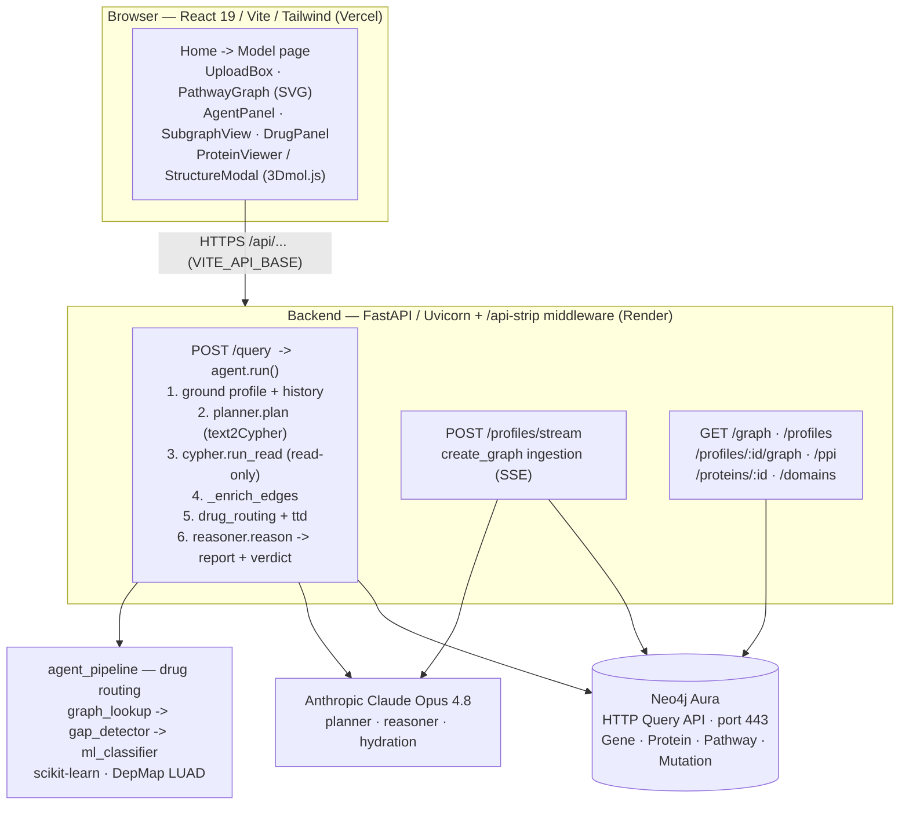

# LUAD Cell-State GraphRAG

**A graph-grounded LLM reasoning system for lung adenocarcinoma (LUAD).**
Upload a tumor mutation profile, see it mapped onto a biological pathway graph, and ask an agent intervention questions ("can I inhibit this?") — it answers by traversing a Neo4j knowledge graph, citing the exact subgraph, and routing drugs through a deterministic lookup plus an ML fallback classifier.

> **🔗 Live demo:** https://frontend-tan-two-ho66t3rmdo.vercel.app
> _(Backend on Render free tier — the first request after idle cold-starts in ~50s, then it's fast.)_

---

## Table of contents
1. [What it does](#1-what-it-does)
2. [Architecture](#2-architecture)
3. [How it works (workflows)](#3-how-it-works-workflows)
4. [Tech stack](#4-tech-stack)
5. [Repository structure](#5-repository-structure)
6. [Getting started](#6-getting-started)
7. [API reference](#7-api-reference)
8. [Tests](#8-tests)
9. [Deployment](#9-deployment)
10. [Design north-star / roadmap](#10-design-north-star--roadmap)

---

## 1. What it does

- **Profile ingestion** — upload a mutation CSV (DepMap-style). Each variant is annotated by an LLM (protein effect: `activating` / `inactivating` / `no_effect`), mapped to its protein and KEGG pathways, and written into a Neo4j graph. Progress streams live via Server-Sent Events.
- **Graph visualization** — the affected genes/pathways render as an interactive network; click a node for details, mutation effect badges, and (for proteins) a 3D structure view.
- **Agentic chat** — ask natural-language questions about the profile or a selected node. The agent generates Cypher (text2Cypher), runs it read-only against Neo4j, enriches the retrieved subgraph, and an LLM reasoner writes a mechanistic, cited report with an intervention verdict (`beneficial` / `harmful` / `negligible` / `uncertain`). The exact reasoning subgraph is rendered alongside the answer.
- **Drug routing** — for the profile's driver mutations, a deterministic graph lookup returns variant-specific targeted drugs (e.g. osimertinib for `EGFR L858R`, sotorasib only for `KRAS G12C`); where the graph has no covering drug (e.g. `KRAS G12D`), an **ML classifier** trained on DepMap LUAD data predicts which activated pathway is a vulnerability. These findings are cited in the chat answer.

---

## 2. Architecture



The graph is the source of truth; the LLM translates, reasons, and explains — it never invents entities outside the retrieved subgraph.

---

## 3. How it works (workflows)

### Workflow A — Profile ingestion (`POST /profiles/stream`, SSE)

```
CSV upload
   │
   ▼ extract_mutations_from_profile        parse rows → mutation records (raw CSV preserved)
   │
   ▼ for each mutation:
   │    hydrate_mutation        (Claude)   → protein, effect (activating/inactivating), identifiers
   │    extract_protein_for_mutation       → KEGG protein record
   │    extract_pathways_for_protein       → pathways the protein participates in
   │    graph.update_pathway               → write Gene/Protein/Pathway/Mutation into Neo4j
   │
   ▼ SSE events streamed to the browser:
     started → mutations_extracted → mutation_hydrated → protein_extracted
            → pathways_extracted → pathway_updated → complete   (graph_warning / error)
```
Consumed by `useAnalysis`; rendered by `MutationSidebar` + `PathwayGraph`.

### Workflow B — Agentic chat (`POST /query`)

```
question + selected context + uploaded mutations + chat history + profile_id
   │
   ▼ ground profile & history into the prompt
   ▼ planner.plan          text2Cypher via Claude, grounded by scripts/init_neo4j/NEO4J_SCHEMA.md
   │                       (deterministic canned-vocabulary fallback if the generated Cypher fails)
   ▼ cypher.run_read       Neo4j HTTP Query API (443) → { rows, subgraph }
   ▼ _enrich_edges         add every relationship among the retrieved nodes (fully-wired subgraph)
   ▼ drug_routing.route    graph drug lookup + ML fallback;  ttd → targeted-therapy hits
   ▼ reasoner.reason       Claude → mechanistic markdown report + verdict, citing the subgraph
   │                       and the drug-routing evidence (ML calls flagged as ML-predicted)
   ▼ response { report, verdict, mode, subgraph, rows, cited_pathways, drug_routing, ttd_drugs,
               cypher, plan_source }
```
Consumed by `useChat`; rendered by `AgentPanel` (answer) + `SubgraphView` (Agent Graph tab) + `DrugPanel`.

### Drug routing detail (`agent_pipeline/`)

```
mutation (gene + variant + DepMap flags)
   │
   ▼ graph_lookup.mutation_to_drugs     unified_graph.json: mutation → active pathways → drugs
   ▼ gap_detector.check_coverage        is each targetable pathway covered by a direct-target drug?
   │      ├─ covered  → report the direct, variant-filtered drug(s)
   │      └─ gap      → ml_classifier.predict_pathway_vulnerability
   ▼ ml_classifier   LogisticRegression (calibrated), GroupKFold-by-gene eval on real DepMap LUAD;
                     features = gene role + identity, pathway, and mutation flags
                     (hotspot / LoF / high-impact / oncogene- & TSG-high-impact)
```
The classifier fires **only on real mutation signal** (a resolved graph variant, a driver-effect call, or a real DepMap impact flag) — a bare gene click with no variant does not produce a guess.

---

## 4. Tech stack

| Layer | Technology |
|---|---|
| Frontend | React 19, Vite, TypeScript, Tailwind CSS, React Router 7; custom SVG for the pathway graph + reasoning subgraph; 3Dmol.js (loaded at runtime) for protein structures |
| Backend | Python, FastAPI, Uvicorn, Pydantic |
| Knowledge graph | Neo4j Aura — accessed over the **HTTP Query API on port 443** (works behind networks that block Bolt/7687) |
| LLM | Anthropic Claude **Opus 4.8** (planner / reasoner / mutation hydration; overridable via `PLANNER_MODEL` / `REASONER_MODEL`) |
| ML | scikit-learn (LogisticRegression + calibration), NumPy — drug-routing fallback classifier |
| Hosting | Vercel (frontend), Render (backend) |

---

## 5. Repository structure

```
backend/
  main.py                         FastAPI app, routes, /api-strip middleware, CORS
  config.py                       env-driven config (Neo4j, Anthropic, model ids)
  neo4j_http.py                   Neo4j HTTP Query API client (443) + subgraph builder
  agents/
    traverse_graph/               the chat agent
      agent.py                    orchestration: ground → plan → query → enrich → route → reason
      planner.py                  natural language → Cypher (text2Cypher) + fallback
      cypher.py                   read-only execution, subgraph assembly
      reasoner.py                 Claude report + verdict (with drug-routing evidence)
    drug_routing.py               wires agent_pipeline into the chat (graph lookup + ML fallback)
    ttd.py / ttd_writer.py        targeted-therapy drug layer (→ ttd_drugs)
    create_graph/                 profile → graph ingestion (extract, hydrate, pathways, write)
  endpoints/
    profiles/                     /profiles/stream (SSE), /profiles, /profiles/{id}/graph|ppi
    protein/                      /proteins/{id}, /proteins/{id}/domains
  tests/                          pytest suite
agent_pipeline/                   drug-routing pipeline (JSON-graph based, runnable standalone)
  graph_lookup.py  gap_detector.py  ml_classifier.py
  unified_graph.json              drug/pathway graph
  pathway_training_examples_v2.json   DepMap LUAD training data for the classifier
frontend/
  src/pages/                      Home, Model, NotFound
  src/components/                 PathwayGraph, AgentPanel, SubgraphView, DrugPanel,
                                  MutationSidebar, MutationDetail, ProteinViewer, StructureModal, ...
  src/hooks/                      useChat, useAnalysis, useProfileGraph, useProfilePPI, ...
  src/lib/api.ts                  API base (VITE_API_BASE)
  vite.config.ts                  dev proxy: /api → http://127.0.0.1:8000
data/                             example profiles (profile_example*.csv), DepMap data
scripts/                          Neo4j schema + loaders (init_neo4j/), DepMap prep
render.yaml                       Render deployment blueprint (backend)
```

---

## 6. Getting started

### Prerequisites
- Python 3.12+ and Node 18+
- A Neo4j Aura instance (or any Neo4j reachable over the HTTP Query API)
- An Anthropic API key

### 1. Environment
Create `backend/.env` (gitignored):
```env
# Neo4j Aura over the HTTP Query API (https → port 443)
NEO4J_URI=https://<your-id>.databases.neo4j.io
NEO4J_USERNAME=neo4j
NEO4J_PASSWORD=<your-password>
# Anthropic
ANTHROPIC_API_KEY=<your-key>
```
Without `ANTHROPIC_API_KEY`, the planner/reasoner fall back to deterministic stubs so the pipeline still runs locally (with reduced reasoning).

### 2. Backend (run from the repo **root** — imports are `backend.*`)
```bash
pip install -r backend/requirements.txt
uvicorn backend.main:app --reload --port 8000
```
Health check: http://127.0.0.1:8000/health

### 3. Frontend
```bash
cd frontend
npm install
npm run dev      # Vite on http://localhost:5173, proxies /api → :8000
```
Leave `VITE_API_BASE` unset for local dev — the Vite proxy handles `/api`.

### (Optional) Load / reload the graph
```bash
python scripts/init_neo4j/upload_http.py
```

---

## 7. API reference

| Method | Path | Purpose |
|---|---|---|
| `GET`  | `/health` | liveness |
| `GET`  | `/graph` | full pathway graph (for the static viz) |
| `POST` | `/query` | agent: question → report, verdict, subgraph, drug_routing, ttd_drugs |
| `POST` | `/profiles/stream` | upload CSV → SSE ingestion stream |
| `POST` | `/profiles/{id}/mutations/{mid}/retry` | re-hydrate a single mutation |
| `GET`  | `/profiles` | saved profile history |
| `GET`  | `/profiles/{id}/graph` | a profile's graph |
| `GET`  | `/profiles/{id}/ppi` | a profile's protein–protein interactions |
| `GET`  | `/proteins/{id}` · `/proteins/{id}/domains` | protein record + domains (structure viewer) |

In production the frontend calls these under an `/api` prefix (e.g. `/api/query`); the backend's `_StripApiPrefix` middleware removes it, so every route keeps its bare path and local dev is unaffected.

---

## 8. Tests

```bash
python -m pytest backend/tests        # run from the repo root
```
Notes:
- The suite reads from whatever DB `backend/.env` points at and is **read-only**; it skips cleanly if the graph is unreachable.
- The core path is deterministic and LLM-free (stubbed), so it runs without spending API credits.
- `backend/tests/test_drug_routing.py` covers the drug-routing matrix (direct-drug cases vs ML fallback) independent of the DB/LLM.

---

## 9. Deployment

Split deploy: **frontend → Vercel, backend → Render**.

- **Backend (Render):** `render.yaml` is a blueprint — build `pip install -r backend/requirements.txt`, start `uvicorn backend.main:app --host 0.0.0.0 --port $PORT` from the repo root. Set `ANTHROPIC_API_KEY`, `NEO4J_URI`, `NEO4J_USERNAME`, `NEO4J_PASSWORD` as service env vars.
- **Frontend (Vercel):** root directory `frontend/`; set `VITE_API_BASE` to the Render backend URL. The frontend then calls the backend directly (CORS is open), which keeps the SSE ingestion stream unbuffered.

CORS is currently `allow_origins=["*"]` for the demo — tighten it to the frontend origin for anything beyond a demo.

---

## 10. Design north-star / roadmap

The implemented system above is a **retrieval + LLM-reasoning pipeline over a curated causal graph**. The longer-term design vision — not yet built — is a fuller causal-simulation engine:

- **Explicit causal inference engine** — structural causal models, Pearl do-calculus, conditional average treatment effects (CATE), counterfactuals (e.g. DoWhy / EconML).
- **Dynamic state-transition simulation** — model resistance evolution and compensatory rewiring over time rather than single-shot retrieval.
- **Richer evidence graph** — drug/perturbation/resistance edges with confidence + publication provenance (DrugBank, OpenTargets, Reactome, LINCS, TCGA).
- **Multi-omics & temporal graphs**, and a possible GNN layer for embeddings/pattern discovery.

These are aspirational direction, not current capabilities — today's reasoning is LLM-over-retrieved-subgraph plus the DepMap-trained drug-routing classifier.
```
